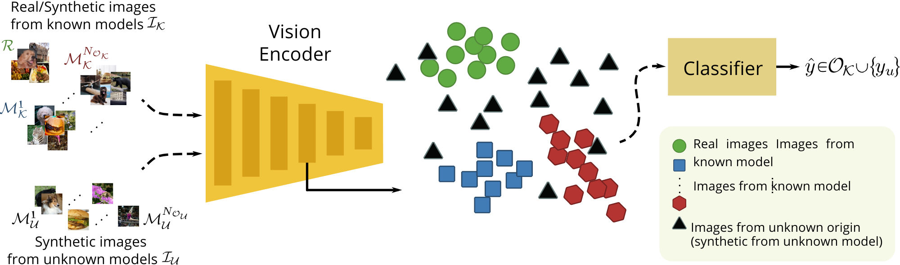

# Are CLIP features all you need for Universal Synthetic Image Origin Attribution?

Authors' official PyTorch implementation of the paper ***"Are CLIP features all you need for Universal Synthetic Image Origin Attribution?"***, accepted in the Trust What You learN (**TWYN**) Workshop of **ECCV 2024**. If you find this code useful for your research, please [cite](#citation) our paper.

> [**Are CLIP features all you need for Universal Synthetic Image Origin Attribution?"**](http://arxiv.org/abs/2408.09153) <br>Dario Cioni, Christos Tzelepis,  Lorenzo Seidenari, and  Ioannis Patras<br>
> Trust What You learN (TWYN) Workshop of ECCV 2024.<br>
> **Abstract:** The steady improvement of Diffusion Models for visual synthesis has given rise to many new and interesting use cases of synthetic images but also has raised concerns about their potential abuse, which poses significant societal threats. To address this, fake images need to be detected and attributed to their source model, and given the frequent release of new generators, realistic applications need to consider an Open-Set scenario where some models are unseen at training time. Existing forensic techniques are either limited to Closed-Set settings or to GAN-generated images, relying on fragile frequency-based "fingerprint" features. By contrast, we propose a simple yet effective framework that incorporates features from large pre-trained foundation models to perform Open-Set origin attribution of synthetic images produced by various generative models, including Diffusion Models. We show that our method leads to remarkable attribution performance, even in the low-data regime, exceeding the performance of existing methods and generalizes better on images obtained from a diverse set of architectures.



## News

- [2024/09] 🏆 Our paper was selected for **Best Paper Award** at ECCV2024 TWYN workshop 🎉

## Code

**Code coming soon...**


## Citation

If you find this work useful, please consider citing it:
```bibtex
@misc{cioni2024clip,
    title={Are CLIP features all you need for Universal Synthetic Image Origin Attribution?},
    author={Dario Cioni and Christos Tzelepis and Lorenzo Seidenari and Ioannis Patras},
    year={2024},
    eprint={2408.09153},
    archivePrefix={arXiv},
    primaryClass={cs.CV}
}
```


## Acknowledgment

This research was supported by the EU's Horizon 2020 programme H2020-951911 [AI4Media](https://www.ai4media.eu/) project.
